# Mid-Term Practical: CI Pipeline with GitHub Actions and Jenkins

**Student Name:** Nikhil Shankar C S
**Course:** PROG8860 - CI/CD  
**Assignment:** Mid-Term Practical  

---

## What I'm Building

This project demonstrates a complete CI/CD pipeline for an Android counter application. The goal is to automate the build, test, and deployment process using both GitHub Actions and Jenkins. The final output is a Docker image that serves test reports and lint analysis through a web interface.

---

## Project Structure

```
PROG8860-CICD/
├── Android/                          # Main Android application
│   ├── app/
│   │   └── src/
│   │       ├── main/
│   │       │   └── java/rebirth/nixaclabs/cicd/
│   │       │       ├── Counter.kt           # Counter logic
│   │       │       └── MainActivity.kt      # UI with Compose
│   │       └── test/
│   │           └── java/rebirth/nixaclabs/cicd/
│   │               └── CounterTest.kt       # Unit tests
│   ├── Dockerfile                    # Multi-stage Docker build
│   └── build.gradle
├── .github/
│   └── workflows/
│       └── android-ci.yml            # GitHub Actions pipeline
├── Jenkinsfile                       # Jenkins pipeline
└── README.md

Separate Repository (AndroidReports):
├── server.py                         # Python HTTP server for reports
└── README.md
```

---

## Application Details

### What the App Does

Simple counter application with basic functionality:
- Display shows a number (starts at 0)
- "+1" button increases the count
- "-1" button decreases the count
- Built with Kotlin and Jetpack Compose

### Test Cases (6 total)

1. Initial counter value is 0
2. Increment increases count by 1
3. Decrement decreases count by 1
4. Multiple increments work correctly
5. Multiple decrements work correctly
6. Increment and decrement together work properly

---

## How to Build and Run

### Local Build

```bash
cd Android
./gradlew assembleDebug
```

APK location: `Android/app/build/outputs/apk/debug/app-debug.apk`

### Run Tests

```bash
cd Android
./gradlew test
```

Test reports generated at: `Android/app/build/reports/tests/testDebugUnitTest/index.html`

### Run Lint

```bash
cd Android
./gradlew lint
```

Lint report generated at: `Android/app/build/reports/lint-results-debug.html`

---

## Docker Setup

### Multi-Stage Build

The Dockerfile uses three stages:

**Stage 1 - Builder:**
- Installs Android SDK and build tools
- Builds the APK
- Runs unit tests and generates HTML report
- Runs lint analysis and generates HTML report

**Stage 2 - Server Repository:**
- Uses alpine/git image
- Created a gitrepo for serving reports using python and is available in the below repository.
- Clones the report server from GitHub (https://github.com/NikhilShankar/AndroidReports.git)
- Provides server.py for the final stage

**Stage 3 - Report Server:**
- Uses lightweight Python base image
- Copies test and lint reports from Stage 1
- Copies server.py from Stage 2
- Runs HTTP server on port 9898
- Final image is small (no Android SDK included)

### Pull and Run the Image

```bash
docker pull niks1267/counter-app-reports:latest
docker run -p 9898:9898 niks1267/counter-app-reports:latest
```

### Access Reports

Open your browser:
- **Home:** http://localhost:9898
- **Test Results:** http://localhost:9898/testresults/index.html
- **Lint Report:** http://localhost:9898/lint/index.html

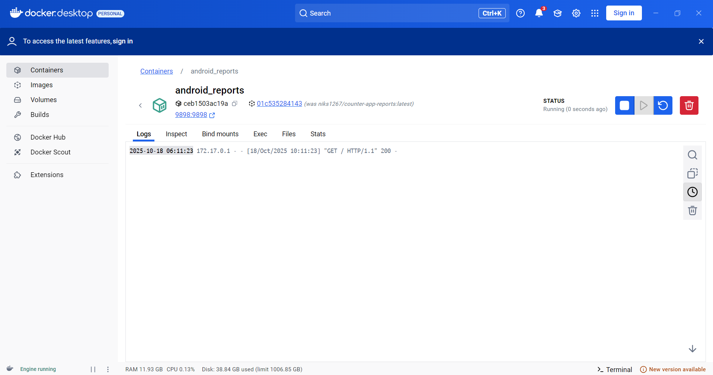

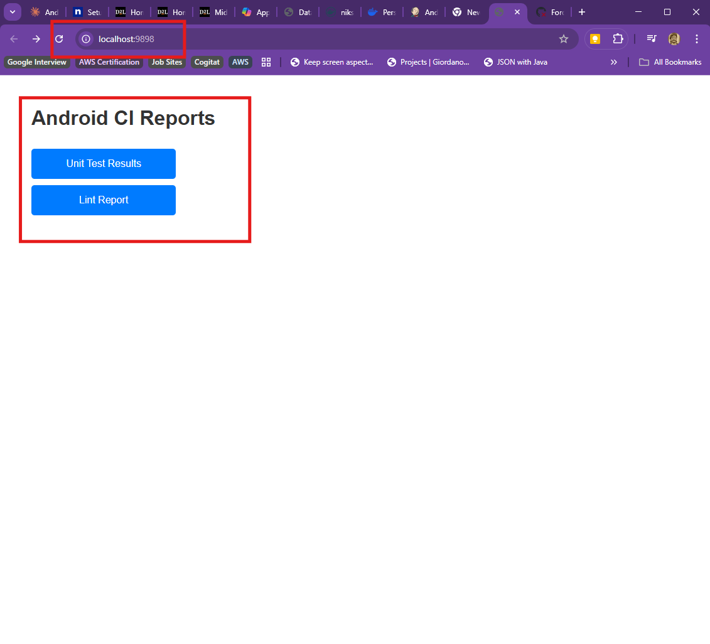

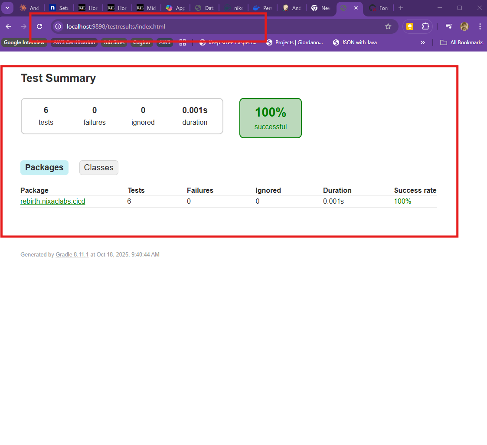

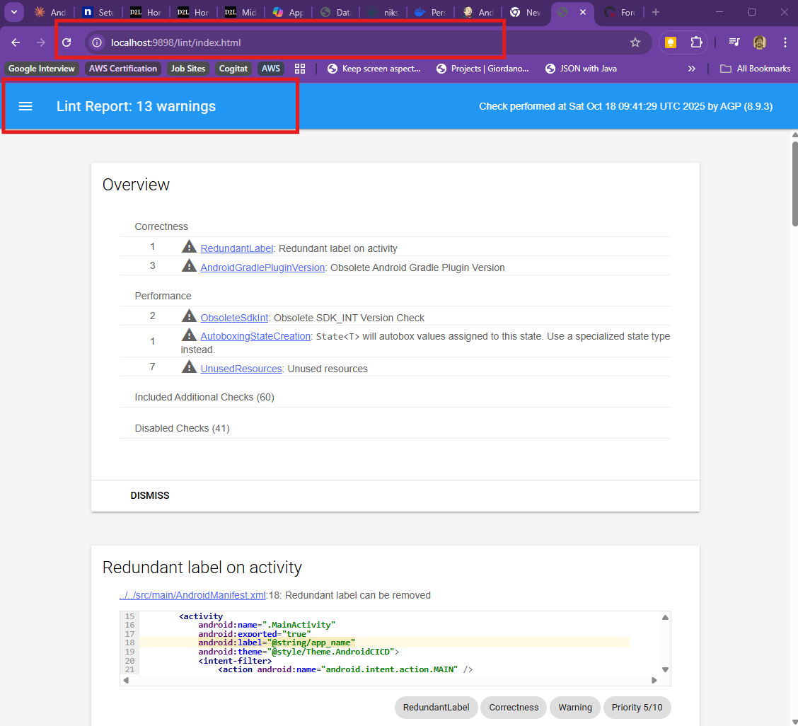

---

## GitHub Actions CI Pipeline

### Pipeline Stages

The workflow file is located at `.github/workflows/android-ci.yml`

**What it does:**
- Triggers on push to Android folder
- Builds the multi-stage Docker image
- Pushes image to Docker Hub
- All build, test, and lint steps happen inside Docker

### How to Test the Pipeline

Push any change to the Android folder:

```bash
git add .
git commit -m "Update Android app"
git push
```

GitHub Actions automatically runs the pipeline.

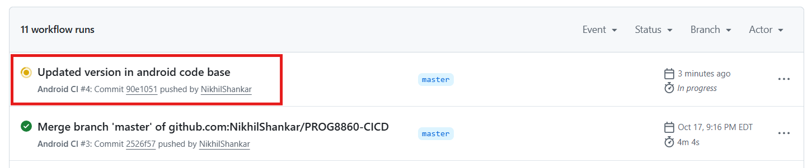

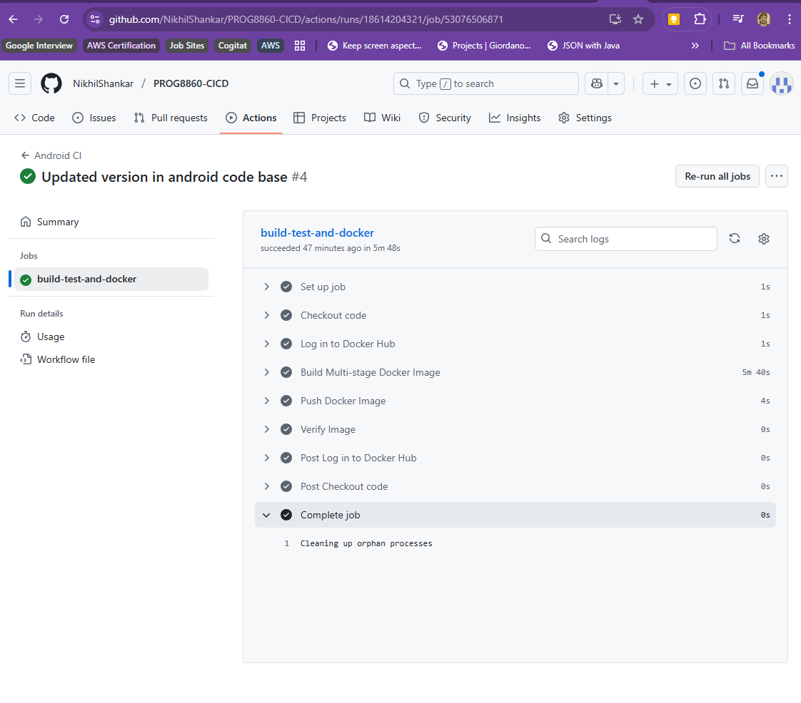

### Demonstrating Success and Failure

**Success scenario:** All tests pass (current state)

**Failure scenario:** 
1. Open `Android/app/src/test/java/rebirth/nixaclabs/cicd/CounterTest.kt`
2. Change line in `testInitialCountIsZero()`:
   ```kotlin
   assertEquals(1, counter.getCount())  // Change 0 to 1
   ```
3. Push the change
4. Pipeline fails because test fails
5. Revert the change
6. Pipeline passes again


---

## Jenkins Pipeline

### Setup

Jenkins runs in Docker:

```bash
docker run -d \
  --name jenkins \
  -p 8080:8080 \
  -p 50000:50000 \
  -v jenkins_home:/var/jenkins_home \
  -v /var/run/docker.sock:/var/run/docker.sock \
  jenkins/jenkins:lts
```

### Pipeline Configuration

The Jenkinsfile is located at the root of the repository.

**Pipeline stages:**
1. **Checkout:** Gets code from GitHub
2. **Build & Test:** Builds Docker image (includes tests and lint)
3. **Push to Docker Hub:** Publishes image to registry

### Webhook Setup

Jenkins is triggered automatically when code is pushed to GitHub.

**Using ngrok for local Jenkins:**
1. Install ngrok: https://ngrok.com/download
2. Run: `ngrok http 8080`
3. Add webhook to GitHub: `https://your-ngrok-url/github-webhook/`
4. Configure Jenkins job to use "GitHub hook trigger for GITScm polling"

### How to Run Jenkins Pipeline

1. Access Jenkins: http://localhost:8080
2. Open "Android-Counter-CI" job
3. Click "Build Now"
4. Or push code to GitHub (webhook triggers automatically)

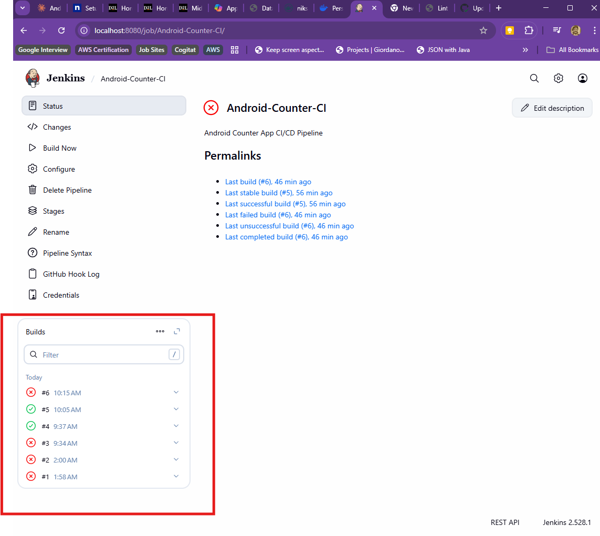

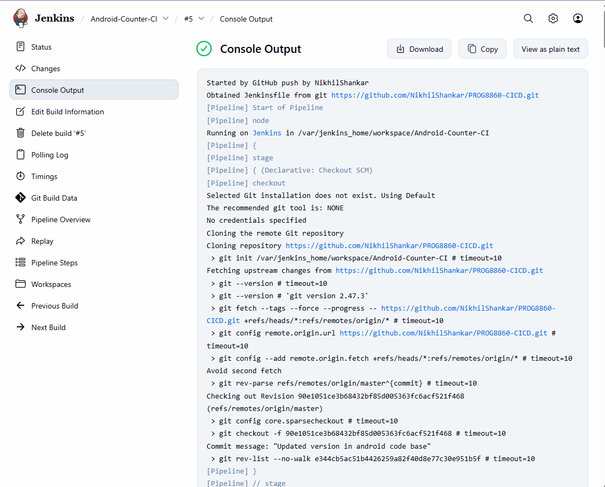

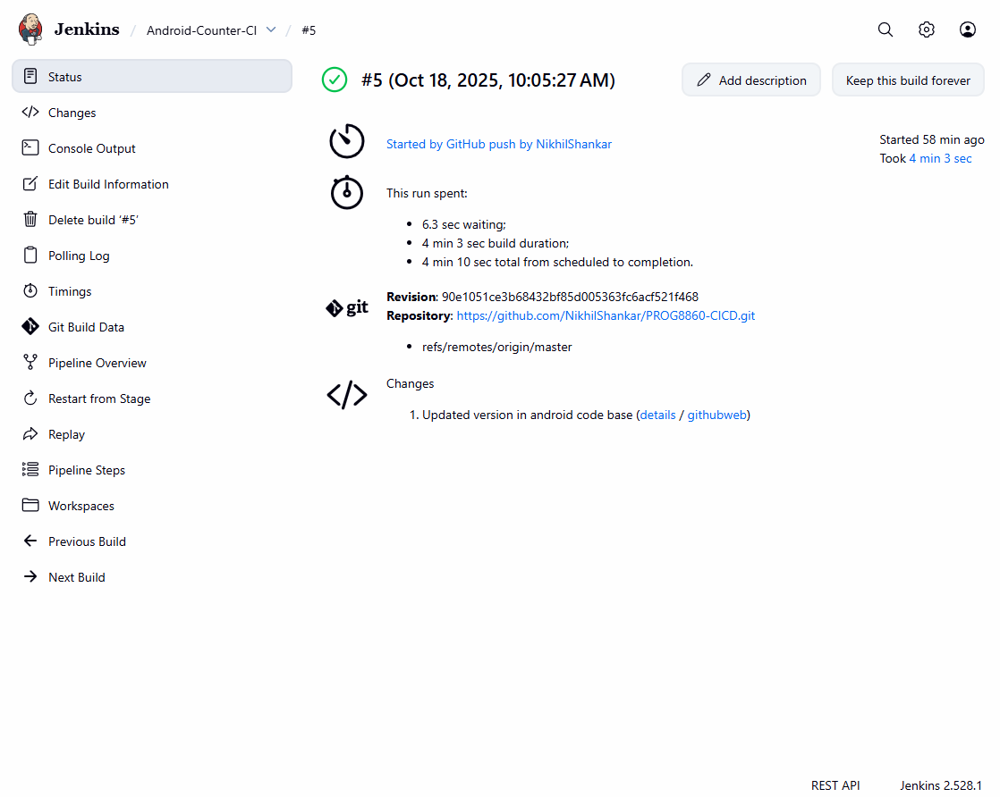

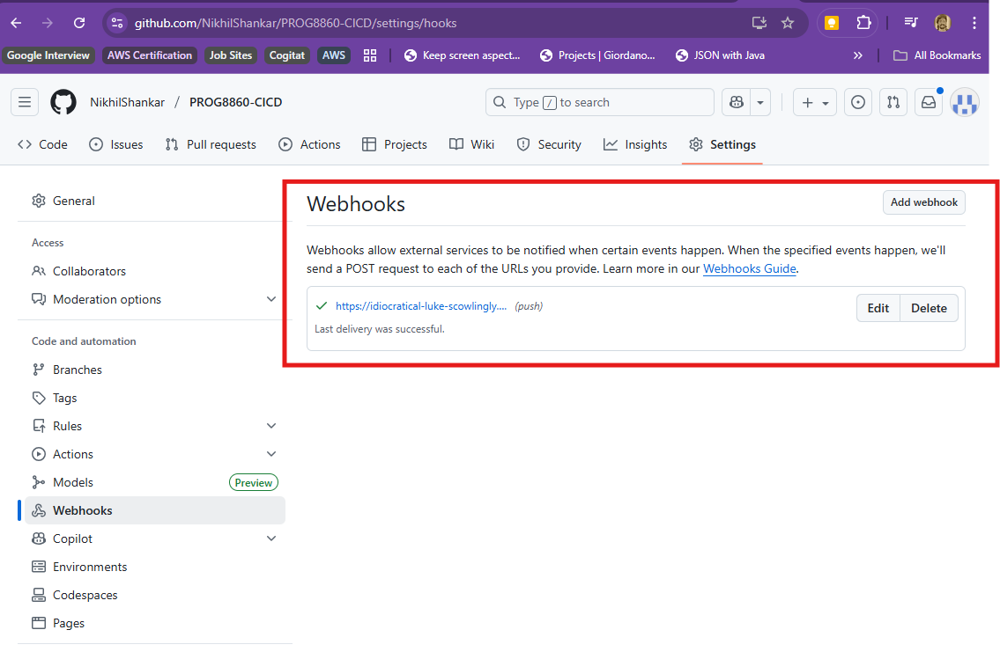

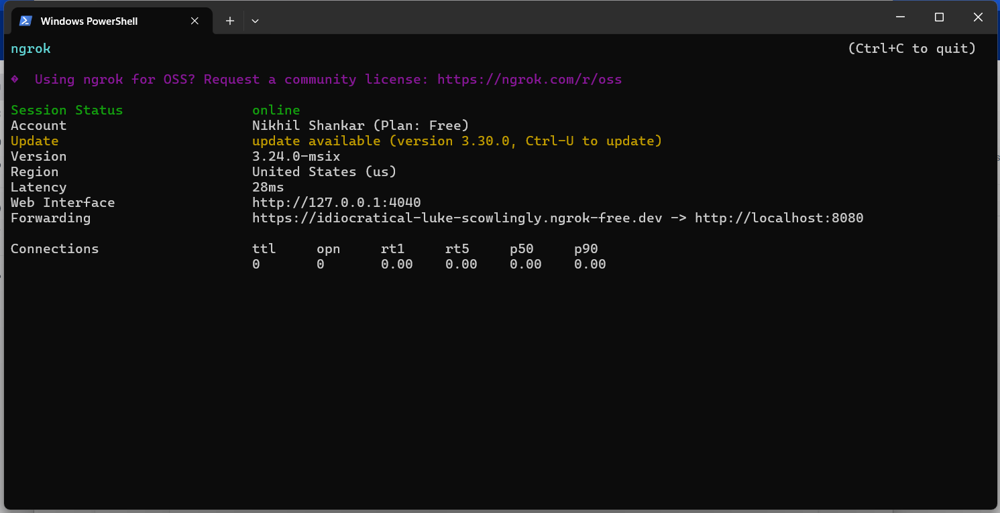

---

## Technologies Used

- **Language:** Kotlin
- **UI Framework:** Jetpack Compose
- **Build Tool:** Gradle
- **Testing:** JUnit
- **CI/CD:** GitHub Actions, Jenkins
- **Containerization:** Docker (multi-stage builds)
- **Report Server:** Python HTTP Server
- **Registry:** Docker Hub
- **Webhook Tunneling:** ngrok

---

## Key Learnings

### Multi-Stage Docker Builds
- Separates build environment from runtime environment
- Reduces final image size significantly
- Clones external repositories during build

### CI/CD Automation
- Automated testing catches errors early
- Docker ensures consistent build environment
- Webhooks enable automatic pipeline triggers

### Pipeline Design
- Build and test stages run independently
- Reports are generated and served automatically
- Same pipeline works in both GitHub Actions and Jenkins

---

## Repository Links

- **Main Repository:** https://github.com/NikhilShankar/PROG8860-CICD
- **Report Server Repository:** https://github.com/NikhilShankar/AndroidReports
- **Docker Hub Image:** https://hub.docker.com/r/niks1267/counter-app-reports

---

## Conclusion

This project demonstrates a complete CI/CD pipeline with automated testing, Docker containerization, and deployment to a registry. The multi-stage build approach and automated webhooks show real-world CI/CD practices. Both GitHub Actions and Jenkins pipelines successfully build, test, and deploy the application.